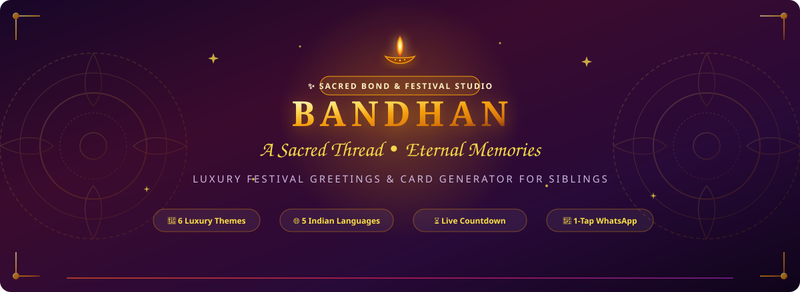

<div align="center">



<br /><br />

[](https://react.dev/)
[](https://www.typescriptlang.org/)
[](https://vitejs.dev/)
[](https://tailwindcss.com/)
[](https://www.radix-ui.com/)
[](LICENSE)

<br />

<p align="center">
  <strong>An ultra-aesthetic, luxury festival greeting portal &amp; custom card studio celebrating the sacred bond between siblings across eternity.</strong>
</p>

<p align="center">
  <a href="#-key-features">Key Features</a> •
  <a href="#-interactive-card-studio">Card Studio</a> •
  <a href="#-tech-stack">Tech Stack</a> •
  <a href="#-quick-start">Quick Start</a> •
  <a href="#-multilingual-support">Languages</a> •
  <a href="#-deep-linking">Deep Linking</a> •
  <a href="#-contributing">Contributing</a>
</p>

</div>

---

## 📖 About Bandhan

> *"A sacred thread of eternal love, protection, and cherished childhood memories."*

**Bandhan** (Code-Matcher) transforms the age-old tradition of **Raksha Bandhan** into an interactive digital celebration. Designed with traditional Indian art aesthetics—including animated flickering diyas, ornate lotus mandalas, silk thread motifs, and marigold torans—the platform allows anyone around the world to craft an embossed, high-definition festive card in seconds.

Whether your siblings are across the room or across the ocean, send personalized blessings directly via WhatsApp, email, or a downloadable 3x high-resolution card.

---

## 🌟 Key Features

<table width="100%">
  <tr>
    <td width="50%" valign="top">
      <h3>🪔 Virtual Rakhi Ceremony Simulator</h3>
      <p>An interactive digital ritual experience! Step-by-step <strong>Sacred Aarti</strong> (circle the glowing diya), <strong>Shubh Tilak</strong> application, <strong>Rakhi Tying</strong> with flower petal showers, and <strong>Festive Mithai</strong> offering (Kaju Katli, Motichoor Ladoo, Gulab Jamun).</p>
    </td>
    <td width="50%" valign="top">
      <h3>🎨 6 Luxury Themes &amp; 4 Embossed Borders</h3>
      <p>Themes: <em>Classic Festive</em>, <em>Royal Gold</em>, <em>Poetic Sunset</em>, <em>Playful Joy</em>, <em>Peacock Emerald</em>, and <em>Imperial Silk</em>.<br/>Frame Borders: <em>Royal Gold Foil</em>, <em>Marigold Blossom</em>, <em>Peacock Emerald</em>, and <em>Imperial Crimson</em>.</p>
    </td>
  </tr>
  <tr>
    <td width="50%" valign="top">
      <h3>⚜️ Sibling Honorary Titles &amp; Badges</h3>
      <p>Decorate cards with custom royal ribbons: <em>Partner in Crime 🕵️</em>, <em>The Guardian &amp; Shield 🛡️</em>, <em>Secret Keeper 🤫</em>, <em>Forever Best Friend 💖</em>, <em>Drama Royalty 👑</em>, or <em>Midnight Snacker 🍕</em>.</p>
    </td>
    <td width="50%" valign="top">
      <h3>🌐 5 Indian Languages (i18n)</h3>
      <p>True localized festival wishes with tailored script typography:</p>
      <ul>
        <li><strong>English</strong> (Outfit &amp; Playfair Display)</li>
        <li><strong>हिन्दी</strong> (Noto Sans Devanagari)</li>
        <li><strong>मराठी</strong> (Noto Sans Devanagari)</li>
        <li><strong>ગુજરાતી</strong> (Noto Sans Gujarati)</li>
        <li><strong>தமிழ்</strong> (Noto Sans Tamil)</li>
      </ul>
    </td>
  </tr>
  <tr>
    <td width="50%" valign="top">
      <h3>⏳ Shravana Purnima Countdown &amp; Muhurat</h3>
      <p>Astronomically calculated countdown (2024 through 2035+) paired with a Vedic <strong>Shubh Muhurat Guide</strong> detailing Aparahna Kaal, Pradosh Kaal, and Purnima Tithi timings.</p>
    </td>
    <td width="50%" valign="top">
      <h3>🎶 Synthesized Audio Chimes &amp; Sitar Drone</h3>
      <p>Zero external MP3 dependencies! In-browser Web Audio API generates temple chimes, celebratory chords, and an optional soothing Indian tanpura/sitar drone harmony.</p>
    </td>
  </tr>
  <tr>
    <td width="50%" valign="top">
      <h3>🖼️ 3x High-Res PNG Card Export</h3>
      <p>Renders a crystal-clear, print-ready digital greeting card with gold embossed borders, personalized recipient name, custom message, and an authentic royal seal.</p>
    </td>
    <td width="50%" valign="top">
      <h3>📲 1-Tap WhatsApp &amp; Deep-Link Sharing</h3>
      <p>Instant sharing pre-configured with personalized greetings, festive emojis, and direct deep-links that reopen the exact card for the recipient.</p>
    </td>
  </tr>
</table>

---

## 🎨 Interactive Card Studio

```
 ┌──────────────────────────────────────────────────────────────────────────┐
 │                           🌼 🍃 FESTIVE TORAN 🍃 🌸                       │
 │                                                                          │
 │                     🪔  [ ANIMATED FLICKERING DIYA ]  🪔                 │
 │                                                                          │
 │                      H A P P Y   R A K H I   2 0 2 6                     │
 │                          A Bond Beyond Words                             │
 │                                                                          │
 │          ┌──────────┐  ┌──────────┐  ┌──────────┐  ┌──────────┐          │
 │          │ 05 DAYS  │  │ 14 HOURS │  │ 28 MINS  │  │ 42 SECS  │          │
 │          └──────────┘  └──────────┘  └──────────┘  └──────────┘          │
 │                                                                          │
 │       ╔════════════════════════════════════════════════════════════╗     │
 │       ║ 🪔                 [ SACRED RAKHI MOTIF ]               🪔 ║     │
 │       ║                                                            ║     │
 │       ║                     Dearest Sibling,                       ║     │
 │       ║                                                            ║     │
 │       ║                        A A R A V                           ║     │
 │       ║                                                            ║     │
 │       ║                   wishes you a joyful                      ║     │
 │       ║                HAPPY RAKSHA BANDHAN 2026                   ║     │
 │       ║                                                            ║     │
 │       ║   "Across every distance and season of life, you remain   ║     │
 │       ║    my greatest guardian and my truest lifelong friend."    ║     │
 │       ║                                                            ║     │
 │       ║                    🪔   🪷   🍬   🔴   💖                  ║     │
 │       ║                                                            ║     │
 │       ║          ⚜️ SACRED RAKHI • TIED WITH ETERNAL LOVE ⚜️         ║     │
 │       ╚════════════════════════════════════════════════════════════╝     │
 │                                                                          │
 │      [ 📲 WhatsApp ]   [ 🖼️ Download PNG ]   [ 📋 Copy Link ]   [ 🔄 Edit ]   │
 └──────────────────────────────────────────────────────────────────────────┘
```

---

## 🛠️ Tech Stack

| Domain | Technology | Purpose |
| :--- | :--- | :--- |
| **Frontend Framework** | `React 18.3` | Dynamic virtual DOM, component memoization, and reactive state |
| **Type Safety** | `TypeScript 5.8` | Strict interfaces for templates, multilingual records, and props |
| **Bundler & Tooling** | `Vite 5.4` | Ultra-fast Hot Module Replacement (HMR) and optimized build chunks |
| **CSS & Utilities** | `Tailwind CSS 3.4` | Responsive grid, glassmorphism utilities, and keyframe animations |
| **Headless UI** | `Radix UI Primitives` | Accessible, robust modals, dropdowns, and interactive widgets |
| **Iconography** | `Lucide React` | Clean, customizable modern SVG icon library |
| **Physics & Confetti** | `canvas-confetti` | Multi-angle festive particle celebration bursts |
| **Canvas Rasterizer** | `html-to-image` | High-fidelity, client-side 3x PNG card generation |
| **Audio Engine** | `Web Audio API` | Pure synthesized harmonic frequencies & bell resonances |
| **Toast Feedback** | `Sonner` | Polished toast notifications on actions, copying, and download |

---

## 🚀 Quick Start

### Prerequisites
- **Node.js**: v18.0.0 or higher
- **Package Manager**: `npm`, `pnpm`, or `bun`

### 1. Clone the Repository
```bash
git clone https://github.com/Rahul08319/code-matcher.git
cd code-matcher
```

### 2. Install Dependencies
```bash
npm install
```

### 3. Run the Development Server
```bash
npm run dev
```
Open your browser at `http://localhost:5173`.

### 4. Build for Production
```bash
npm run build
```
Optimized assets will be generated in the `dist/` directory.

---

## 📂 Directory Layout

```
code-matcher/
├── banner.svg                    # Vector artwork hero banner for GitHub
├── index.html                    # Root HTML with Google Fonts preloading
├── package.json                  # Scripts and package dependencies
├── tailwind.config.ts            # Custom colors, keyframes, and themes
├── vite.config.ts                # Vite bundler configuration
├── public/                       # Static public assets
│   └── rakhi-banner.svg          # High-resolution banner
└── src/
    ├── App.tsx                   # QueryClient, Toasters, and Router
    ├── index.css                 # Festive CSS variables, animations, and typography
    ├── main.tsx                  # React DOM root entry
    ├── components/
    │   ├── FestiveDecorations.tsx # Rakhi motif, Diya, Mandala, & Toran SVGs
    │   └── ui/                   # Button, Input, Sonner, and Radix components
    ├── lib/
    │   ├── rakhi-dates.ts        # Dynamic festival calendar algorithm (2024–2035)
    │   ├── rakhi-i18n.ts         # Multilingual translations, 6 themes & stickers
    │   ├── soundEffects.ts       # Web Audio API chime synthesis
    │   └── utils.ts              # Tailwind class merging utility (cn)
    └── pages/
        ├── Index.tsx             # Main festival studio, customizer & card display
        └── NotFound.tsx          # 404 page
```

---

## 🌐 Multilingual Support (i18n)

Every language is natively translated with culturally authentic greetings:

| Code | Language | Native Name | Sample Verse |
| :---: | :--- | :--- | :--- |
| `en` | English | English | *"We gain and lose things every day — but you'll never lose me."* |
| `hi` | Hindi | हिन्दी | *"प्रेम, रक्षा और अनगिनत यादों का पवित्र धागा। हैप्पी राखी!"* |
| `mr` | Marathi | मराठी | *"शब्दांपलीकडचं नातं, प्रेमाचा पवित्र धागा... हॅप्पी रक्षाबंधन!"* |
| `gu` | Gujarati | ગુજરાતી | *"પ્રેમ, રક્ષા અને અસંખ્ય યાદોનો પવિત્ર દોરો. હેપી રાખી!"* |
| `ta` | Tamil | தமிழ் | *"அன்பு, பாதுகாப்பு மற்றும் நினைவுகளின் புனித நூல்... வாழ்த்துகள்!"* |

---

## 🔗 Deep-Linking URL Parameters

Share a customized card that opens directly with your personalization using URL parameters:

```
https://<domain>/?bl=Aarav&lang=hi&tpl=royal&stk=diya,lotus,tilak&msg=You%20are%20the%20best!
```

- `bl`: Recipient's name (spaces automatically replaced with `-`)
- `lang`: Language code (`en`, `hi`, `mr`, `gu`, `ta`)
- `tpl`: Theme identifier (`classic`, `royal`, `poetic`, `playful`, `peacock`, `silk`)
- `stk`: Comma-separated sticker IDs (`diya`, `lotus`, `mithai`, `tilak`, `gift`, `heart`)
- `msg`: Optional custom handwritten greeting

---

## 🤝 Contributing

We welcome community contributions, additional language translations, and new decorative themes!

1. **Fork** the project
2. **Create your feature branch**:
   ```bash
   git checkout -b feature/NewFestiveTheme
   ```
3. **Commit your changes**:
   ```bash
   git commit -m "feat: add NewFestiveTheme with lotus ornaments"
   ```
4. **Push to your branch**:
   ```bash
   git push origin feature/NewFestiveTheme
   ```
5. **Open a Pull Request**

---

## 📜 License

Distributed under the **MIT License**. Feel free to use, modify, and distribute with attribution.

<br />

<div align="center">
  <sub>🪔 Crafted with heartfelt love for brothers &amp; sisters everywhere • Celebrating Raksha Bandhan 🪔</sub>
</div>
